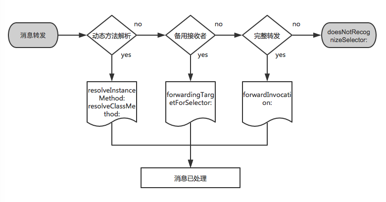

# iOS-Runtime

###一、类和对象
Objective-C 对象实际上是一个C里面的结构体指针，这个我们可以通过id类型理解，大家都知道id可以指向任意对象，id本身是一个对象，然后是个指针，所以它指向对象时，不要加“*”。

下面是id类型的定义：

	/// id 是一个指向 objc_object 结构体的指针.
	typedef struct objc_object *id;
	
Objective-C 类实际上也是一个C里面的结构体指针，这个我们通过Class类型理解。

	/// 一个不透明的类型代表一个Objective-C类.
	typedef struct objc_class *Class;

**那么 objc_object 和 objc_class 这两个结构体又表示了些什么东西？**

objc_object 结构体的定义：

	/// Represents an instance of a class.
	struct objc_object {
   	 	Class isa  OBJC_ISA_AVAILABILITY;
	};

objc_class 结构体的定义：

	struct objc_class {
    	Class isa  OBJC_ISA_AVAILABILITY;

	    Class super_class  						// 父类                                   
	    const char *name   						// 类名                                     
	    long version       						// 类的版本信息                                      
	    long info          						// 类信息，供运行期使用的一些位标识                                    
	    long instance_size                    	// 类的实例变量大小                  
	    struct objc_ivar_list *ivars           	// 类的成员变量链表                 
	    struct objc_method_list **methodLists  	// 方法定义的链表                  
	    struct objc_cache *cache               	// 方法缓存                  
	    struct objc_protocol_list *protocols   	// 协议链表                
		
	} OBJC2_UNAVAILABLE;

现在我们列出来了两个结构体的定义，发现了一个大问题，它们里面都有一个叫 isa 的变量。
这个 isa 是干什么的呢？看下图：

当对象初始化时，会分配内存，并初始化其成员变量，也就是为对象的结构体 objc_class 分配内存，让其中的 isa 指针可以访问类以及其继承体系。

也就是说当我们的对象是一个实例的时候，isa指向实例所属的类；当对象为类的时候，isa指向meta-class（元类）。

其它相关结构体中的参数，在消息机制中才会解释。元类这个我不作解释了。

总结：

1、Objective-C 的实例和类都是一个对象；
2、Objective-C 的对象实际上就是一个结构体；
3、对象是通过 isa 指针获取类的信息。

###二、方法
方法和上面讲的类和对象也是一样的，它也是一个结构体：

	/// An opaque type that represents a method in a class definition.
	typedef struct objc_method *Method;

它在objc/runtime.h里面的定义是
 
	struct objc_method {
	    SEL method_name                 OBJC2_UNAVAILABLE;  // 方法名
	    char *method_types              OBJC2_UNAVAILABLE;
	    IMP method_imp                  OBJC2_UNAVAILABLE;  // 方法实现
	}

解释下其中的SEL和IMP变量：

#####什么是SEL？
SEL一般我们称为选择器，它在objc.h中的定义如下：

	/// An opaque type that represents a method selector.
	typedef struct objc_selector *SEL;

SEL是一个指向 objc_selector 结构体的指针。

可以通过以下三种方法来获取到了SEL:

**SEL sel_registerName(const char *str)**

**@selector(selector)**

**SEL NSSelectorFromString(NSString *aSelectorName)**

 	SEL sel = @selector(length);
    NSLog(@"%s", sel_getName(sel));
    NSLog(@"%p", sel);
    
    const char *selName = [@"length" UTF8String];
    SEL sel2 = sel_registerName(selName);
    NSLog(@"%s", sel_getName(sel2));
    NSLog(@"%p", sel2);
    
    SEL sel3 = NSSelectorFromString(@"length");
    NSLog(@"%s", sel_getName(sel3));
    NSLog(@"%p", sel3);
    
    NSLog(@"%d", sel_isEqual(sel, sel2));
    NSLog(@"%d", sel_isEqual(sel2, sel3));

打印结果：

通过上面我们发现Objective-C的方法是根据方法名来区别的。每一个方法都对应着一个SEL。所以在Objective-C同一个类(及类的继承体系)中，不能存在2个同名的方法，即使参数类型不同也不行。相同的方法只能对应一个SEL。

通过 clang -rewrite-legacy-objc 还发现 @selector 实际上就是 sel_registerName 函数。

结论：SEL 通过方法名代表着这个方法，每个方法对应着一个唯一的SEL，同类或者它的继承体系中，不能有相同的两个SEL。

#####什么是IMP？
IMP 在objc.h 中的定义如下：

	/// A pointer to the function of a method implementation. 
	typedef id (*IMP)(id, SEL, ...); 

IMP 是一个函数指针，通过SEL获得指向方法的入口地址。id表示调用方法的对象，SEL标示着方法，...表示方法的一些参数。

总结：

1、SEL 通过方法名代表着这个方法，每个方法对应着一个唯一的SEL，同类或者它的继承体系中，不能有相同的两个SEL；

2、IMP 是一个函数指针，通过SEL获得指向方法的入口地址。

###三、消息发送机制

在Objective-C中，消息直到运行时才绑定到方法实现上。下面来看看消息发送具体是怎么样的。

新建一个helloClass类在 helloClass 类里面定义一个实例方法和一个类方法：

新建一个 HelloWorldClass 的类，继承自 HelloClass 类，在里面写一个helloWorldMethod方法：

通过clang命令：

	$ clang -rewrite-legacy-objc HelloWorldClass.m

得到 helloWorldMethod方法C++代码：

首先，我们看下 helloWorldMethod 方法C++代码中两个参数，这两个参数在OC方法中是隐藏的，第一个参数是调用该方法的对象，第二个参数就是该方法的SEL。

在运行时，消息绑定到方法实现上，编译器将方法调用转换为objc_msgSend，参考向实例对象发送 helloInstanceMethod 消息：

	objc_msgSend(obj, sel_registerName("helloInstanceMethod"))

当我们obj对象初始化的时候，也就是初始化了obj 结构体 objc_class。

当我们向obj对象发送helloInstanceMethod消息时，objc_msgSend函数通过obj对象中的isa指针获取到类的结构体，先从方法缓存方法列表cache methodLists中寻找，找到了调用对应函数实现；如果没有找到，再从方法列表methodLists里面找，如果找不到，一直沿着继承树往基类找；基类中如果没有就会走消息转发、动态方法解析(后面会讲)。

前面说过类也是对象，向类对象发送消息的流程和向实例对象发送消息的流程是一样的，这里不细说。

当我们向父类发送消息时，参考向super发送 helloInstanceMethod 消息，使用的是objc_msgSendSuper函数：

	objc_msgSendSuper(struct objc_super *super, SEL op, ...)
	
它的第一个参数是一个指向objc_super 结构体的指针，objc_super结构体在objc/message.h中的定义如下：
	
	/// Specifies the superclass of an instance. 
	struct objc_super {
    /// Specifies an instance of a class.
    __unsafe_unretained id receiver;

    /// Specifies the particular superclass of the instance to message. 
	#if !defined(__cplusplus)  &&  !__OBJC2__
    /* For compatibility with old objc-runtime.h header */
    __unsafe_unretained Class class;
	#else
    __unsafe_unretained Class super_class;
	#endif
    /* super_class is the first class to search */
	};
	#endif

一共有二个参数，第一个是消息接受的实例，第二个是父类。helloInstanceMethod中的objc_super结构第一个参数传入的self，第二个参数最后得到父类HelloClass。使用super编译器标示符发送消息实际上和self发送消息的机制是一样的，只是去父类的方法列表中找该方法。

最后使用clang命令

	$ clang -rewrite-objc HelloWorldClass.m
	
发现一些关于元类的细节：

前面说的元类的东西一直没有看到，在这个里面证明了"OC-类和对象"里面的那张isa游走图。

根据这张图可以推断出来HelloWorldClass类的isa指针指向HelloWorldClass的元类，而HelloWorldClass的元类的isa指针执行的是基类NSObject的元类。

###四、消息转发机制

当正常的消息发送走不通的时候，会走下面的消息转发机制：

消息转发机制基本分为三个步骤：

1、动态方法解析

2、备用接受者

3、完整转发

新建一个HelloClass的类，定义两个方法：

	@interface HelloClass : NSObject
	- (void)hello;
	+ (HelloClass *)hi;
	@end

##### 动态方法解析
对象在接收到未知的消息时，首先会调用所属类的类方法+resolveInstanceMethod:(实例方法)或者+resolveClassMethod:(类方法)。在这个方法中，我们有机会为该未知消息新增一个”处理方法”“。不过使用该方法的前提是我们已经实现了该”处理方法”，只需要在运行时通过class_addMethod函数动态添加到类里面就可以了。

	void functionForMethod(id self, SEL _cmd)
	{
	    NSLog(@"Hello!");
	}
	
	Class functionForClassMethod(id self, SEL _cmd)
	{
	    NSLog(@"Hi!");
	    return [HelloClass class];
	}
	
	#pragma mark - 1、动态方法解析
	+ (BOOL)resolveClassMethod:(SEL)sel
	{
	    NSLog(@"resolveClassMethod");
	    NSString *selString = NSStringFromSelector(sel);
	    if ([selString isEqualToString:@"hi"])
	    {
	        Class metaClass = objc_getMetaClass("HelloClass");
	        class_addMethod(metaClass, @selector(hi), (IMP)functionForClassMethod, "v@:");
	        return YES;
	    }
	    return [super resolveClassMethod:sel];
	}
	
	+ (BOOL)resolveInstanceMethod:(SEL)sel
	{
	    NSLog(@"resolveInstanceMethod");
	
	    NSString *selString = NSStringFromSelector(sel);
	    if ([selString isEqualToString:@"hello"])
	    {
	        class_addMethod(self, @selector(hello), (IMP)functionForMethod, "v@:");
	        return YES;
	    }
	    return [super resolveInstanceMethod:sel];
	}

##### 备用接受者
动态方法解析无法处理消息，则会走备用接受者。这个备用接受者只能是一个新的对象，不能是self本身，否则就会出现无限循环。如果我们没有指定相应的对象来处理aSelector，则应该调用父类的实现来返回结果。

	#pragma mark - 2、备用接收者
	- (id)forwardingTargetForSelector:(SEL)aSelector
	{
	    NSLog(@"forwardingTargetForSelector");
	    
	    NSString *selectorString = NSStringFromSelector(aSelector);
	    
	    // 将消息交给_helper来处理
	    if ([selectorString isEqualToString:@"hello"]) {
	        return _helper;
	    }
	    return [super forwardingTargetForSelector:aSelector];
	}

在本类中需要实现这个新的接受对象

	@interface HelloClass ()
	{
	    RuntimeMethodHelper *_helper;
	}
	@end
	
	@implementation HelloClass
	
	- (instancetype)init
	{
	    self = [super init];
	    if (self) {
	        _helper = [RuntimeMethodHelper new];
	    }
	    return self;
	}
	
RuntimeMethodHelper 类需要实现这个需要转发的方法：

	#import "RuntimeMethodHelper.h"

	@implementation RuntimeMethodHelper
	- (void)hello
	{
	    NSLog(@"%@, %p", self, _cmd);
	}
	@end

##### 完整消息转发
如果动态方法解析和备用接受者都没有处理这个消息，那么就会走完整消息转发：

	#pragma mark - 3、完整消息转发
	- (void)forwardInvocation:(NSInvocation *)anInvocation
	{
	    NSLog(@"forwardInvocation");
	    if ([RuntimeMethodHelper instancesRespondToSelector:anInvocation.selector]) {
	        [anInvocation invokeWithTarget:_helper];
	    }
	}
	
	/*必须重新这个方法，消息转发机制使用从这个方法中获取的信息来创建NSInvocation对象*/
	- (NSMethodSignature *)methodSignatureForSelector:(SEL)aSelector
	{
	    NSMethodSignature *signature = [super methodSignatureForSelector:aSelector];
	    if (!signature)
	    {
	        if ([RuntimeMethodHelper instancesRespondToSelector:aSelector])
	        {
	            signature = [RuntimeMethodHelper instanceMethodSignatureForSelector:aSelector];
	        }
	    }
	    return signature;
	}

###五、+load方法 和 +initialize方法

#####1、+load 方法

+load 方法是当类或分类被添加到 Objective-C runtime 时被调用的，实现这个方法可以让我们在类加载的时候执行一些类相关的行为。子类的 +load 方法会在它的所有父类的 +load 方法之后执行，而分类的 +load 方法会在它的主类的 +load 方法之后执行。但是不同的类之间的 +load 方法的调用顺序是不确定的。

子类 +load 方法等父类先执行完 +load 方法才执行。
分类 +load 方法会在它的主类 +load 方法之后执行。

#####2、+initialize 方法

+initialize 方法是在类或它的子类收到第一条消息之前被调用的，这里所指的消息包括实例方法和类方法的调用。也就是说 +initialize 方法是以懒加载的方式被调用的，如果程序一直没有给某个类或它的子类发送消息，那么这个类的 +initialize 方法是永远不会被调用的。那这样设计有什么好处呢？好处是显而易见的，那就是节省系统资源，避免浪费。

runtime 使用了发送消息 objc_msgSend 的方式对 +initialize 方法进行调用。也就是说 +initialize 方法的调用与普通方法的调用是一样的，走的都是发送消息的流程。换言之，如果子类没有实现 +initialize 方法，那么继承自父类的实现会被调用；如果一个类的分类实现了 +initialize 方法，那么就会对这个类中的实现造成覆盖。

因此，如果一个子类没有实现 +initialize 方法，那么父类的实现是会被执行多次的。

###六、Method Swizzling

#####1、Method Swizzling 原理

Objective-C 的每一个方法都有一个唯一对应的SEL，而方法是运行时绑定的，利用这些特性，我们可以在运行时调换方法的实现。前面我们说过，IMP 是一个函数指针，通过SEL获得指向方法的入口地址。下面是正常情况下SEL对应IMP函数指针的情况：
	

Method Swizzling 实现的原理就是调换IMP的指向：

#####2、Method Swizzling 应用

#####3、注意事项

1、在+load方法中使用；

2、命名规范，带前缀；

3、在dispatch_once中执行，保证代码不管在多少个线程情况下，只被执行一次。
   
   
###三、
  
  
  
  
